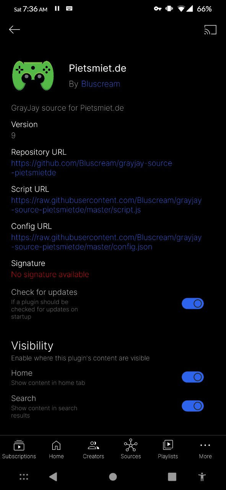

# GrayJay pietsmiet.de source
## Installation
<a href="https%3A%2F%2Fraw%2Egithubusercontent%2Ecom%2FBluscream%2Fgrayjay%2Dsource%2Dpietsmietde%2Fmaster%2Fconfig%2Ejson">grayjay://plugin/https://raw.githubusercontent.com/Bluscream/grayjay-source-pietsmietde/master/config.json</a>
```
https://raw.githubusercontent.com/Bluscream/grayjay-source-pietsmietde/master/config.json
```
<p align="center">
  
</p>
<hr>

## Screenshots

Home | Video | Streams | Source
:-------------------------:|:-------------------------:|:-------------------------:|:-------------------------:
 |  |  | 

## Mirrors
- https://github.com/Bluscream/grayjay-source-pietsmietde
- https://gitlab.com/Bluscream/grayjay-source-pietsmietde
- https://git.minopia.de/blu/grayjay-source-pietsmietde
