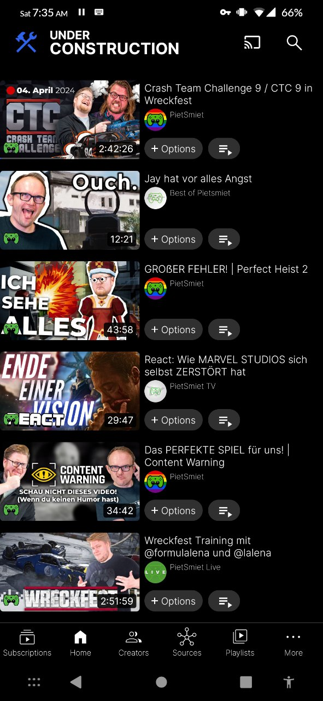
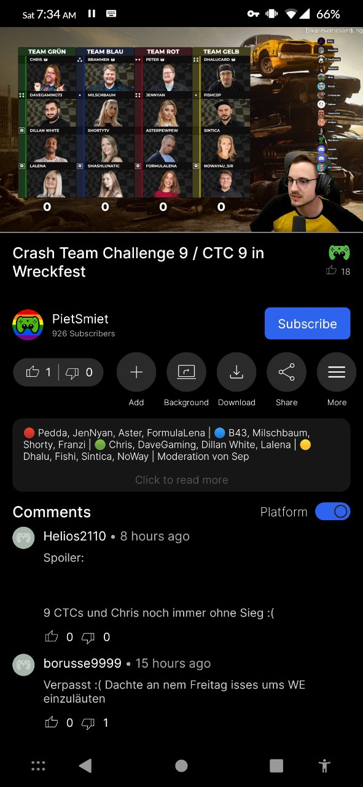
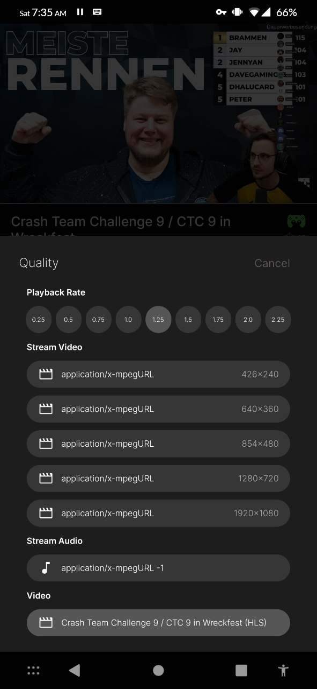
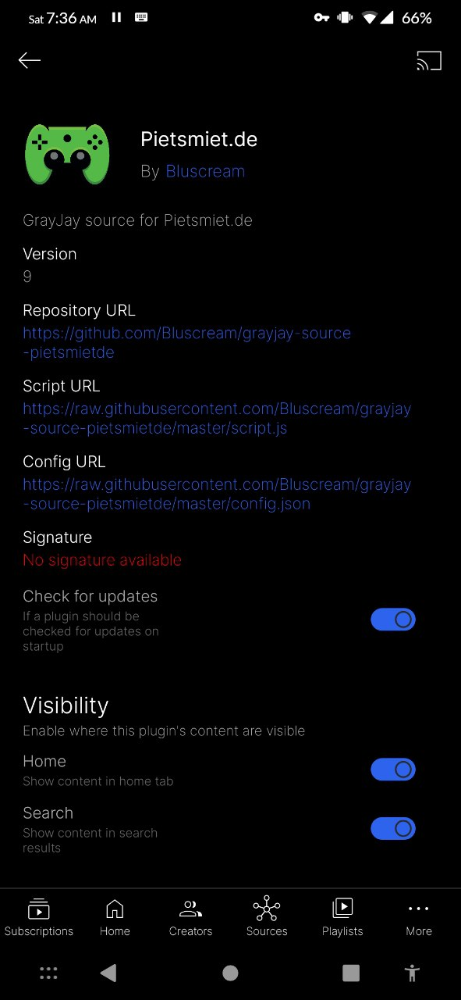

# GrayJay [pietsmiet.de](https://www.pietsmiet.de/) source

> [!CAUTION]  
> As of 01.03.2025 the Pietsmiet.de website has been substituted with a placeholder page and the API is no longer accessible, therefor this plugin and all other 3rd party tools relying on the page are permanently offline.

## Installation

Copy and paste the link below into your browser to open the plugin in Grayjay

```text
grayjay://plugin/https://github.com/grayjay-sources/grayjay-source-pietsmietde/releases/latest/download/config.json
```

[](grayjay://plugin/https://github.com/grayjay-sources/grayjay-source-pietsmietde/releases/latest/download/config.json)

## Screenshots

Home | Video | Streams | Source
:-------------------------:|:-------------------------:|:-------------------------:|:-------------------------:
 |  |  | 

## Mirrors

- <https://github.com/Bluscream/grayjay-source-pietsmietde>
- <https://gitlab.com/Bluscream/grayjay-source-pietsmietde>
- <https://git.minopia.de/blu/grayjay-source-pietsmietde>

## Contributions

- Uses <https://pietsmiet.zaanposni.com/api/>
- Uses <https://returnyoutubedislike.com/docs/>
- Uses <https://yt.lemnoslife.com/noKey/>

## Development

1. install typescript `tsc` and `node/npm`, `deno` or, `bun`
2. `npm update` or equivalent
3. `tsc`
4. `npm run dev:node` or equivalent
